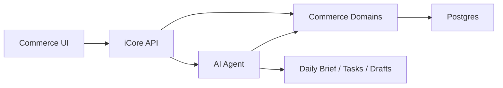

# iCore Commerce OS 产品设计与市场分析

日期：2026-07-02

## 1. 背景

iCore 当前更像一个通用 AI 工作台：有账号、聊天、文件、Agent、支付、网关、Pi 代码分析服务等基础能力。这个底座适合继续保留，但如果要公开部署并投广告试水，需要把产品表层收窄成一个明确业务场景。

本设计建议将 iCore 的对外产品定位为：

> iCore Commerce OS：面向小型跨境电商与贸易团队的 AI 运营驾驶舱，自动发现 SKU、库存、利润、订单、供应商和客服异常，并生成每日运营建议与待办任务。

这不是一个完整 ERP，也不是 Shopify/Amazon 的替代品。它是一个跨平台、跨表格、跨业务系统的 AI 运营判断层。

## 2. 市场分析

### 2.1 市场机会

小型跨境电商团队通常不是缺一个聊天机器人，而是缺一个每天帮他们整理经营状态、发现异常、安排优先级的运营助手。

典型痛点包括：

- 订单、库存、供应商、物流、客服数据分散在多个系统和表格中。
- 老板每天靠人工看表，难以及时发现利润下降、库存断货、物流异常。
- 小团队没有专职数据分析和运营管理岗位。
- 传统 ERP 太重，配置复杂；平台后台只覆盖自己平台内的数据。
- AI 已经能做总结、解释、生成草稿，但需要绑定真实业务数据才有价值。

### 2.2 竞争格局

平台方已经在做 AI。

- Shopify Sidekick 官方定位为 Shopify 店铺内置 AI 助手，能访问 Shopify 数据、理解 commerce workflows，并在 Shopify admin 中执行动作。参考：<https://www.shopify.com/sidekick>
- Amazon SP-API 覆盖订单、库存、报表、定价、消息等卖家运营能力。参考：<https://developer-docs.amazon.com/sp-api/>
- Amazon 也在推进卖家侧 AI 助手，例如 Project Amelia，面向卖家提供经营洞察和排障建议。

成熟第三方工具也已经很多：

- Helium 10 / Jungle Scout：Amazon 选品、关键词、广告、利润分析。
- Gorgias / Chatwoot：电商客服、工单、自动回复。
- Odoo / ERPNext：ERP、销售、采购、库存、财务。
- Metabase：BI 看板和报表分析。

因此 iCore 不应该进入这些方向：

- 不做 Shopify Sidekick 的平替。
- 不做 Amazon 工具大全。
- 不做完整 ERP。
- 不做纯客服系统。
- 不做单纯 BI 看板。

### 2.3 iCore 的切口

iCore 应该做：

> 跨平台运营判断层 + AI 待办任务中心。

平台方 AI 的优势在平台内数据和平台内操作。iCore 的机会在平台外：

- 供应商报价和交期。
- 采购成本、头程物流、尾程物流。
- Excel/CSV 表格。
- 多平台订单汇总。
- 客服问题和运营问题沉淀。
- 老板视角的每日经营判断。

一句话：平台 AI 帮商家在平台里操作，iCore 帮小团队跨系统经营。

## 3. 目标客户

第一阶段目标客户不是大卖家，而是小型跨境团队：

- 1-20 人团队。
- 有 Shopify、Amazon、独立站、TikTok Shop 或其他平台之一。
- SKU 数量约 10-500。
- 仍在用 Excel、飞书、Notion、微信、邮箱管理供应商和成本。
- 没有成熟 ERP，或者已有系统但运营分析仍靠人工。
- 老板、运营、采购、客服角色可能由同一两个人承担。

早期不建议服务大客户。大客户集成复杂、采购周期长、流程定制多，不适合当前阶段验证。

## 4. 产品定位

### 4.1 产品口号

> 每天自动告诉跨境电商老板：哪些 SKU 在赚钱，哪些快断货，哪些订单异常，今天该优先处理什么。

### 4.2 核心价值

- 减少老板和运营每天看表时间。
- 提前发现库存断货、利润下降、退款增多、物流异常。
- 把 AI 分析转成可执行任务。
- 让供应商沟通、客服回复、运营日报从手工变成半自动。

### 4.3 产品边界

iCore v0.1 做：

- 数据导入。
- 运营看板。
- AI 日报。
- SKU 和成本管理。
- 库存风险分析。
- 供应商管理。
- AI 任务中心。

iCore v0.1 不做：

- 完整订单履约系统。
- 完整会计系统。
- 自动下采购单。
- 自动退款。
- 自动改价。
- 多仓复杂 WMS。
- 全量 Amazon/Shopify 深度集成。

## 5. 服务一家小团队还是多家团队

这是关键产品设计问题。两种模式差异很大。

### 5.1 单团队模式

单团队模式是“给一家团队深度服务”的产品形态，更像 AI-assisted 服务系统。

适合阶段：

- 还没有真实客户。
- 你自己先运营一个小店。
- 或者找一家朋友/合作商团队做试点。

设计特点：

- 可以先不做复杂多租户。
- 可以允许人工配置和手工导入。
- 权限可以简单，先有 owner/admin/operator 三类。
- 数据模型可以更贴近这一家团队的实际流程。
- AI 任务可以半自动，后台人工辅助也可以接受。
- 重点是快速验证真实痛点，而不是产品标准化。

优点：

- 上线快。
- 学业务快。
- 定制成本可控。
- 更容易做深。
- 能拿到真实运营反馈。

缺点：

- 不容易直接规模化。
- 容易被单一客户需求牵着走。
- 需要后续抽象为标准产品。

单团队模式推荐目标：

> 90 天内通过一个真实小店或一家试点客户，把 AI 运营日报、库存预警、供应商任务这三个流程跑通。

### 5.2 多团队 SaaS 模式

多团队模式是标准 SaaS，面向多家公司、多店铺、多用户。

适合阶段：

- 已经验证 3-5 家团队有相同痛点。
- 已经知道哪些字段、流程、报表是共性的。
- 已经有人愿意付费。

设计特点：

- 必须有 organization / workspace / tenant 概念。
- 所有业务数据必须按租户隔离。
- 每个租户可以连接多个店铺。
- 每个店铺可以属于一个或多个销售渠道。
- 需要 RBAC 权限、审计日志、套餐限制、用量计费。
- AI 任务执行必须有审批和追踪。
- 集成凭证必须加密存储。

优点：

- 可规模化。
- 可标准化收费。
- 更像真正 SaaS。
- 能支撑广告获客和自助注册。

缺点：

- 初期开发量明显更大。
- 需要更严格的数据隔离、权限、账单和安全设计。
- 如果业务场景没验证，容易做出空架子。

多团队模式推荐目标：

> 当试点模式验证后，把通用流程抽象成标准租户 SaaS，并支持自助注册、示例数据、CSV 导入和基础套餐。

### 5.3 推荐策略

推荐采用“双层设计”：

- 产品体验先按单团队试点做，降低复杂度。
- 技术底座从第一天保留多租户扩展点。

也就是说：

- UI 可以先服务一个团队。
- 数据模型必须带 `organization_id`。
- 业务对象必须属于 organization。
- 后台能力先不暴露复杂租户管理。
- 权限先简化，但不要写死单用户。

这样不会过早陷入重 SaaS，也不会未来推倒重来。

## 6. MVP 功能设计

### 6.1 运营驾驶舱

目标：让用户登录后 5 秒内知道今天业务是否健康。

核心卡片：

- 今日销售额。
- 今日订单数。
- 估算毛利率。
- 低库存 SKU 数。
- 异常订单数。
- 待处理客服数。
- 供应商待跟进数。
- AI 今日建议数。

核心列表：

- 今日优先处理任务。
- 风险 SKU。
- 异常订单。
- 供应商提醒。

### 6.2 AI 运营日报

目标：每天生成一份老板能看懂的经营摘要。

日报结构：

- 昨日经营概览。
- 销售变化。
- 利润变化。
- 库存风险。
- 订单/物流异常。
- 客服高频问题。
- 今日建议动作。

日报输出形式：

- App 内页面。
- 可复制文本。
- 可导出 Markdown/PDF。
- 后续可推送到邮件、飞书、Slack。

### 6.3 SKU 与成本管理

核心字段：

- SKU。
- 商品名称。
- 平台/渠道。
- 售价。
- 采购成本。
- 头程物流成本。
- 尾程物流成本。
- 平台费用。
- 广告成本。
- 估算毛利。
- 供应商。
- 状态：active / paused / discontinued。

AI 用途：

- 找出低毛利 SKU。
- 找出利润下降 SKU。
- 解释利润变化原因。
- 生成调价/优化建议。

### 6.4 库存与补货预警

核心字段：

- SKU。
- 当前库存。
- 可售库存。
- 近 7/14/30 天销量。
- 日均销量。
- 可售天数。
- 供应商交期。
- 安全库存。
- 建议补货量。
- 风险等级。

AI 用途：

- 预测断货风险。
- 解释补货建议。
- 生成供应商询价/催货草稿。

### 6.5 供应商管理

核心字段：

- 供应商名称。
- 联系人。
- 联系方式。
- 主要 SKU。
- 报价。
- MOQ。
- 交期。
- 付款方式。
- 历史问题。
- 最近跟进时间。

AI 用途：

- 生成询价邮件。
- 生成催货消息。
- 总结供应商历史表现。
- 提醒交期风险。

### 6.6 任务中心

任务来源：

- AI 自动发现。
- 用户手工创建。
- 规则触发。

任务类型：

- 补货。
- 供应商跟进。
- 订单异常处理。
- 客服回复。
- SKU 成本复核。
- 运营分析。

任务状态：

- suggested。
- approved。
- in_progress。
- done。
- dismissed。

第一版所有高风险动作都只生成建议和草稿，不自动执行。

## 7. 数据接入设计

### 7.1 第一版接入方式

优先级：

1. 示例数据。
2. CSV 上传。
3. 手工录入。
4. Shopify dev store 接入。
5. Amazon SP-API 预留。

不建议第一版先做重 API 集成。当前最重要的是验证用户是否愿意上传数据、阅读诊断报告、接受任务建议。

### 7.2 CSV 模板

第一版提供四张模板：

- `products.csv`
- `orders.csv`
- `inventory.csv`
- `suppliers.csv`

导入后生成：

- Dashboard。
- AI 日报。
- SKU 风险列表。
- 补货建议。
- 供应商任务。

## 8. 信息架构

建议导航：

- Dashboard
- Daily Brief
- Tasks
- Products / SKUs
- Inventory
- Suppliers
- Orders
- Support
- AI Assistant
- Data Import
- Settings

AI Assistant 不再是主入口，而是右侧上下文助手。

用户在不同页面问的问题应该绑定当前业务上下文：

- 在 Inventory 页面问断货。
- 在 Suppliers 页面问催货。
- 在 Orders 页面问异常。
- 在 Dashboard 页面问今日优先级。

## 9. 技术架构

保留当前 iCore 账号、支付、Agent、文件、网关基础能力，新增 Commerce 业务域。

建议模块：

```text
commerce/
  catalog
  orders
  inventory
  suppliers
  logistics
  support
  analytics
  tasks
  integrations
```

业务数据由 Commerce Domain 拥有，Agent 不直接拥有业务数据。Agent 通过工具调用业务服务。



### 9.1 租户模型

从第一天加入：

- `organization`
- `organization_member`
- `commerce_workspace`
- `sales_channel`

即使早期只服务一家团队，也不要把数据绑定到单个用户。

建议所有 Commerce 表都带：

- `organization_id`
- `created_by`
- `created_at`
- `updated_at`

### 9.2 权限模型

第一版三类角色足够：

- owner：管理组织、账单、集成、全部数据。
- operator：管理 SKU、订单、库存、任务。
- viewer：只读看板和日报。

后续再增加采购、客服、财务等细分角色。

### 9.3 AI 执行边界

第一版 AI 只允许：

- 分析。
- 总结。
- 生成草稿。
- 生成任务。
- 标记风险。

需要人工确认的动作：

- 发送邮件。
- 回复客户。
- 修改价格。
- 创建采购单。
- 发起退款。
- 修改库存。

## 10. 商业模式

第一阶段建议卖“AI 运营诊断服务”，不要急着卖复杂 SaaS。

试水价格：

- 免费：上传示例数据，生成一次诊断。
- Starter：$29-$49/月，适合一个小店，CSV 导入，基础日报。
- Pro：$99-$199/月，多店铺，多用户，供应商任务，库存预警。
- Assisted Pilot：$499-$999/月，包含人工辅助配置和月度运营复盘。

早期最重要的不是定价精确，而是验证用户是否愿意把数据交给你，并为持续诊断付费。

## 11. 广告与获客

### 11.1 核心落地页 Offer

> 上传订单和库存表，免费生成一次 AI 运营诊断报告。

### 11.2 广告文案

- 你的 Shopify/Amazon 店哪些 SKU 正在亏钱？
- 库存断货前 14 天自动提醒。
- 每天一份跨境电商老板日报。
- 把订单、库存、供应商表格变成 AI 待办清单。

### 11.3 转化路径

1. 用户点击广告。
2. 进入落地页。
3. 查看示例运营日报。
4. 上传 CSV 或预约诊断。
5. 系统生成诊断报告。
6. 引导注册或预约 15 分钟沟通。

## 12. 90 天路线图

### 第 1-2 周：产品表层改造

- 改首页定位。
- 改 App 首页为运营驾驶舱。
- 加示例数据。
- 加示例 AI 日报。

### 第 3-4 周：数据导入

- CSV 导入 products/orders/inventory/suppliers。
- 基础数据校验。
- 导入历史记录。

### 第 5-6 周：核心分析

- 销售汇总。
- 毛利估算。
- 库存可售天数。
- 低库存预警。
- SKU 风险列表。

### 第 7-8 周：AI 任务闭环

- AI 运营日报。
- AI 生成任务。
- 任务状态管理。
- 供应商沟通草稿。

### 第 9-12 周：公开试水

- 部署公开版本。
- 做广告落地页。
- 小预算广告投放。
- 访谈 10-20 个潜在用户。
- 找 1-3 家试点团队。

## 13. 成功指标

产品验证指标：

- 访问落地页后的留资率。
- 上传 CSV 的比例。
- 生成诊断后预约沟通比例。
- 用户是否愿意持续上传数据。
- 用户是否愿意为日报/预警付费。

业务价值指标：

- 用户每天少看表的时间。
- 提前发现的断货风险数量。
- 发现的低毛利 SKU 数量。
- AI 建议转任务的比例。
- 任务完成率。

## 14. 结论

iCore Commerce OS 应该先服务一个真实小团队或自营实验店，把业务跑深；但技术设计必须保留多团队 SaaS 扩展能力。

推荐产品策略：

> 单团队试点体验 + 多租户技术底座。

推荐 MVP：

> AI 运营日报 + 库存补货预警 + 供应商任务助手。

这条路线比直接做完整 ERP 更轻，也比通用 AI 平台更有明确商业抓手。
